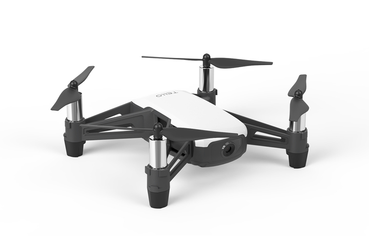

Dette projekt omhander DJI's Tello droner, som er lavet til undervisningsbrug.

Vægt og lovgivning
Vægt, 80g
Kategori, A1/A3
(billede af sort telle)

Sensorer
720p kamera
Barometer
Rangefinder
(billede af hvid drone fra toppen)

Flyve ydelse
Højde, 30m
Rækkevidde, 100m
Flyvetid, max 13min

Hvordan holder den sig i luften og sin position?

Hvordan kommunikere man med den?

Download software
(billede af kaspers kode)

Kommandoer
(billede af commands)
