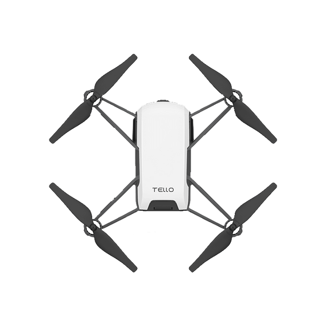

Dette projekt omhander DJI's Tello droner, som er lavet til undervisningsbrug.

Vægt og lovgivning
Vægt, 80g
Kategori, A1/A3
(billede af sort telle)

Sensorer
720p kamera
Barometer
Rangefinder

Flyve ydelse
Højde, 30m
Rækkevidde, 100m
Flyvetid, max 13min

Hvordan holder den sig i luften og sin position?

Hvordan kommunikere man med den?
Tello dronen kommunikere gennem wifi, det vil sige at dronen, og devicet skal være sluttet til samme wifi. Dog kan dronen også håndtere bluetooth hvis wifi ikke er tilgængeligt.

Download software
(billede af kaspers kode)

Kommandoer

Eksempelkode som kan bruges til at lette dronen:
Koden findes i filen: firstFlightTest.py 
Koden er fundet på https://collabnix.com/how-to-control-dji-tello-mini-drone-using-python/ som også har andre eksempler på hvordan dronens funktioner betjenes